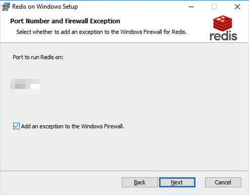

# oTreeをAmazon EC2で使ってみる

ホントはHeroku推奨のようですが，その他サーバを使ってたり，会計処理を一本化するためにAmazon EC2を利用してますよ，ってことでEC2へのインストール方法について．

実はそこまで情報ゴリゴリではない（サーバの扱いとか詳しくない）ので，スコまで明るくはないのですがログとして残しておくとこれからのためになるだろう，ってことで参考までに．

## EC2の設定

新しいインスタンスを作ります．

その後，Windowsで検索をして，これを使います．

もっといいのがあるのかもしれないけど，とりあえずこれで．

このプランにします，というのもインストール作業がなかなか時間かかってイライラするので，ここだけ課金しまくり．

EC2のメリットはスケーラブルに動かせるので，必要な時に課金すればサクサク作業ができるのがありがたいです．

と，この調子で書き続けると流石にしんどいので詳しい人に任せておいて，

※こちらなどを参照．

あと，やらないとまずいのは以下のこと．

* Elastic IPの割り振り

* ポートの開放

HTTPを開けておかないと外部との通信ができない＝ブラウザでアクセスできません．

一気にサーバの設定から．

これからはAnacondaによるPythonのインストール，Postgresqlのインストール，redisのインストール，そしてoTreeのインストールへ．

## サーバ上の作業

### AnacondaによるPythonのインストール

基本的に新しいPython3シリーズが入ればよいのですが（今は6や7か）使い慣れているのがAnacondaなのでAnacondaにします．ただそれだけの理由なので，別に何でも良いと思うのですが．．．

ここから[ダウンロード](https://www.anaconda.com/download/)．

素直にダウンロード．

非推奨だけど，Pathを通しておいた方が良さげ．

インストールできたっぽいので次へ．

ついでにVisual Studio Codeを入れておいた方が楽なので入れておきましょう．

Windows上でコードを触ることはないのですが，一応入れておきます．

基本的には手元のMacでコードを書く→Dropboxで同期させる→実行するって環境を作っているのであまり実はそこまで困らなかったりします．

さて，インストールできました．

※実はoTreeはPython 3.7ではまだ調子がよろしくないらしい（正確には，otree\_utilsというパッケージが）．なので一度Anaconda 3でPython 3.7をインストールした後にバージョンを落とすという作業をしました．

Anacondaナビゲータを使えば簡単

．．．しかし時間がかかるなぁ．

しかし，otree\_utilsを使わなければ別にいらないコストなのですが．

### Postgresqlのインストール

oTreeはSQLiteが入っていてもともと使える感じなのですが，本気の実験するにはPostresqlとかを使ったほうが良いよと推奨されているのでPostgresqlを[ここから](https://www.enterprisedb.com/downloads/postgres-postgresql-downloads)ダウンロード．

11シリーズでうまく進まなかったことがあるので，今回は確実な10シリーズでいってみようと思います．

基本的にはPathも何もそのまま．

いろいろ全部インストールしておきます．

ここのパスは忘れたらどうにもならないので覚えておきましょう．

ポート番号はデフォルトで良さそう．

日本の設定を入れておこう．

そうすれば勝手に上手いことしておいてくれるでしょう．

あ，あと環境変数への追加を忘れてはいけません．

その先のこともやっておきましょう．

pgAdminを使って，`django_db`という名前のデータベースを作ります．

この画面に入る時にインストール時に設定したパスワードが求められます．

### Redisのインストール

[ここ](https://github.com/MicrosoftArchive/redis/releases)からRedis for Windowsをインストールします．

Pathは通しておきます．

特にいじりません．

### oTreeのインストール

 あとはPowershellで動かしていきます．

oTreeのインストールは「oTreeのインストールと起動」をご覧ください．

### psycopg2のインストール

### Firewallの設定

いかんせん，外部からアクセスするためにはサーバ内部のFirewallも設定が必要です．

Inbound Rulesを設定します．

New Rulesで80番を開ければ大丈夫．

All ConnectionをAllowします．

これで無事にoTreeサーバとして機能し始めました．

外部からアクセスしてます．

